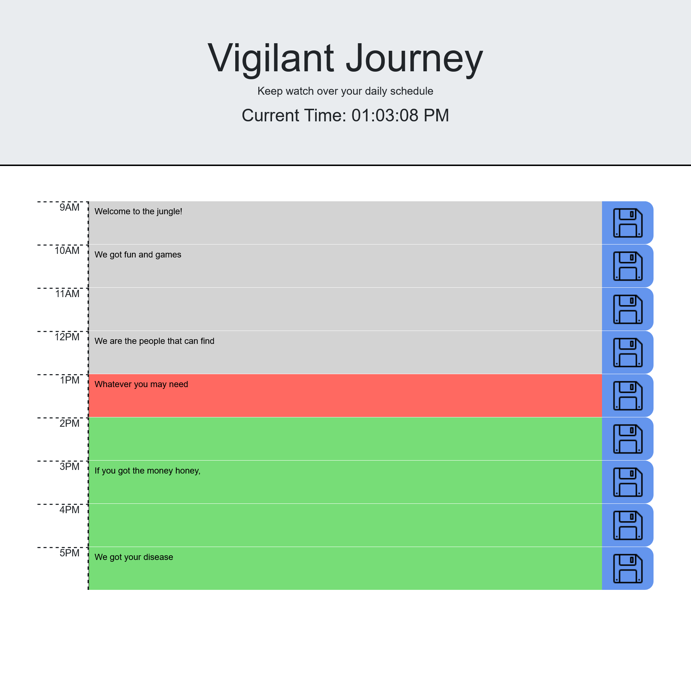

# Vigilant Journey - A Day Scheduler
A scheduler to help people plan their work days

Description
=====
A scheduler for planning your day.

Text can be entered into the grey text areas and saved by clicking the save icon to the right. Saved text will be loaded upon refreshing or revisiting the page. The text areas will be colored grey, red, and green, for hours in the past, present, and future respectively.

Demo
=====
Here's a live deployed version of the scheduler: [https://kurtbixby.github.io/vigilant-journey-day-scheduler/](https://kurtbixby.github.io/vigilant-journey-day-scheduler/).

Credits
=====
__[Kurt Bixby](https://github.com/kurtbixby)__ wrote the JavaScript, CSS, and HTML from scratch.

Save icon sourced from [Icons8](https://icons8.com/icon/18765/save).

Favicon sourced from [Icons8](https://icons8.com/icon/5i5HZ4Z4FfKN/schedule).

## Collaborators
__[Sara B](https://github.com/missatrox44)__ pointed out that there were starter assets, which were used to finish writing the CSS.
